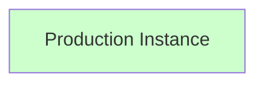
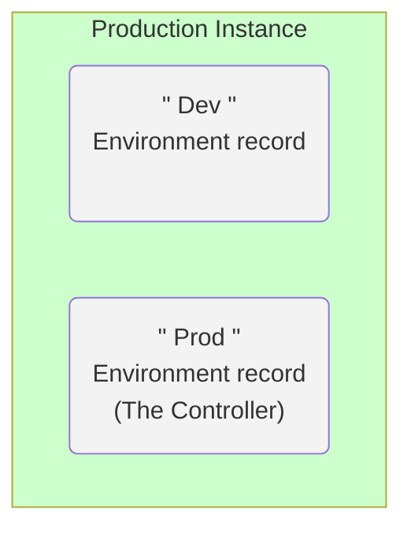
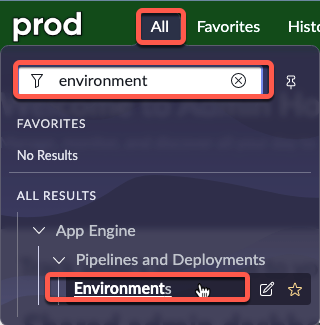
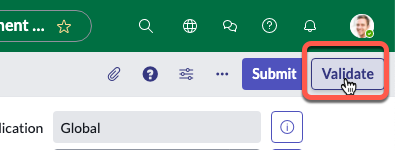
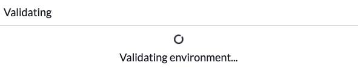
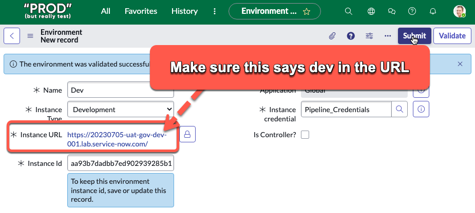
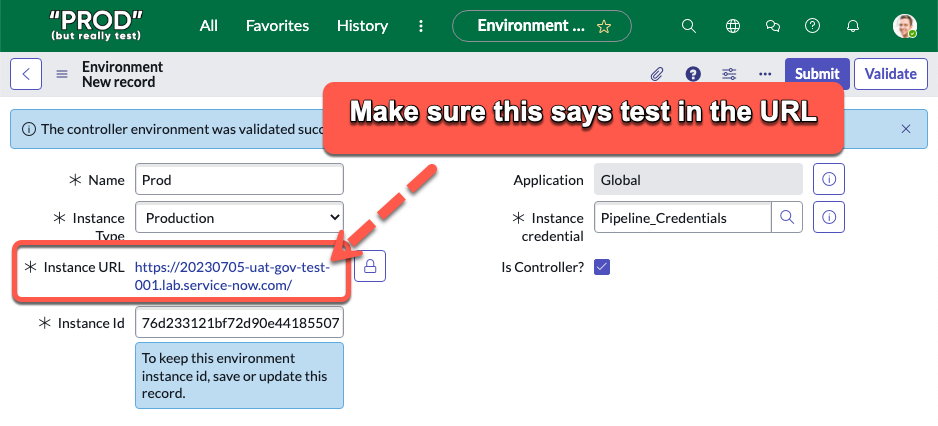
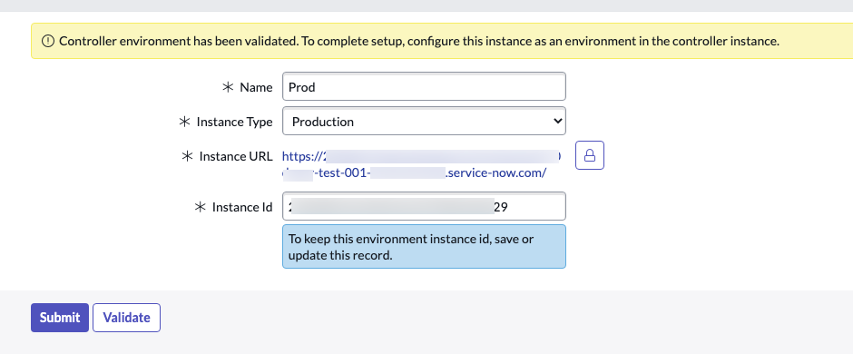

# Create Environments

import TimeEstimate from '@site/src/components/TimeEstimate';

<TimeEstimate>Estimated Time to Complete: 10 minutes</TimeEstimate>

## Overview 

**<a href="https://docs.servicenow.com/csh?topicname=config-pipeline-environments.html&version=latest" target="_blank">Environments ↗</a>** contain information about a ServiceNow instance and how to access it.

Next, you will create an Environment record for both "Production" and "Development" on the Controller instance where AEMC is installed

### Before

### After

## Instructions

:::caution
For this exercise, the specific Application Scope is not critical - Global is acceptable. Always check with your Platform Administrator for any company policies around **<a href="https://docs.servicenow.com/csh?topicname=connection-alias.html&version=latest" target="_blank">Connection and Credential Aliases ↗</a>**.
:::

:::warning
**Complete this section in PROD.**
:::

1. Log in to **Prod**.

2. Click **All** >> type **environment** >> click **Environments**

3. Click **New** in the top-right.

4. Complete the form as below.

:::caution
**FOR THE INSTANCE URL YOU MUST PUT THE DEV INSTANCE URL!!!**
:::

|Field | Value 
|---|---
|**Name** | Dev
|**Instance Type** | Development 
|**Instance URL** | 
|**Instance credential** | Pipeline_Credentials 
|**Is Controller?** | **UNCHECKED**
|**Instance Id** | This will auto populate after clicking Validate. 

5. Click **Validate**

You should see a blue message that says "The environment was validated successfully". 

6. Click **Submit** to finish creating the environment record.

7. Click **New** in the top right.

8. Complete the form as below.

:::caution
**FOR THE INSTANCE URL YOU MUST PUT THE PROD INSTANCE URL!!!**
:::

|Field | Value 
|---|---
|**Name** | Prod 
|**Instance Type** | Production 
|**Instance URL** | 
|**Instance credential** | Pipeline_Credentials 
|**Is Controller?** | **CHECK THE BOX**
|**Instance Id** | This will auto populate after clicking Validate. 

9. Click the "Validate" button. 

You should see a blue or yellow message that says "*The controller environment was validated successfully*". 

10. Click **Submit** to finish creating the environment record.

## Lessons Learned

In this exercise, you have:

- Understood the function and importance of Environment records in the ServiceNow platform.

- Acquired the knowledge of validating these Environment records.

- Successfully configured Environment records for both Development and Production instances in your Prod environment.