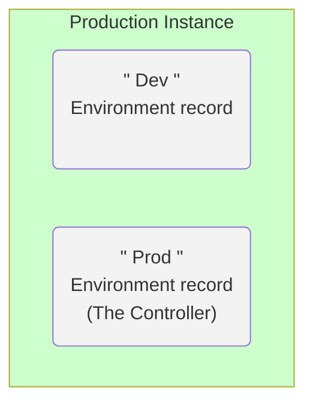
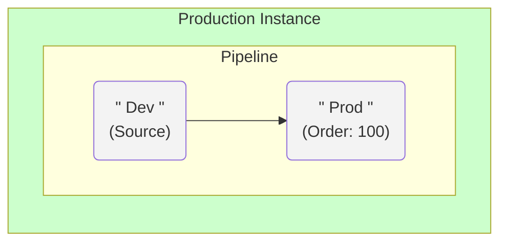
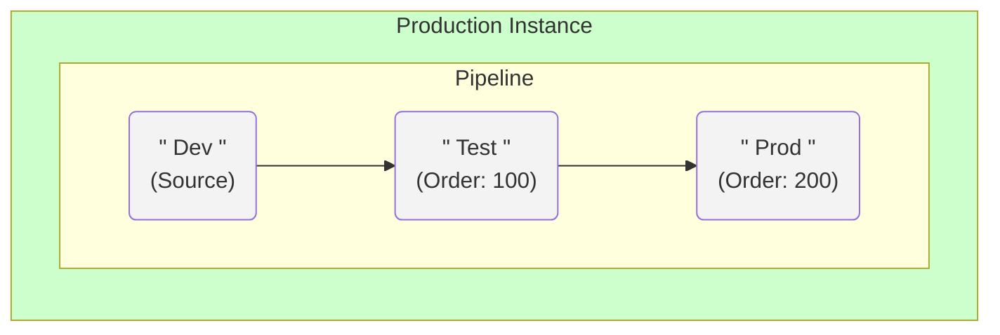
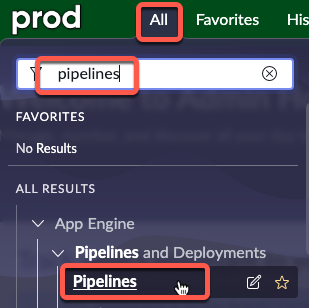
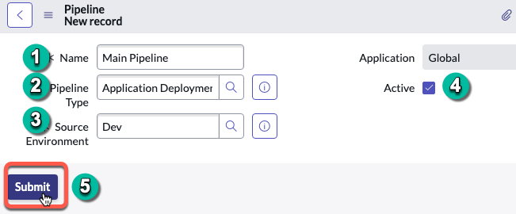
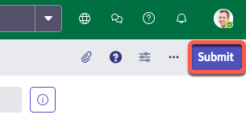
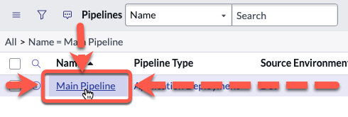
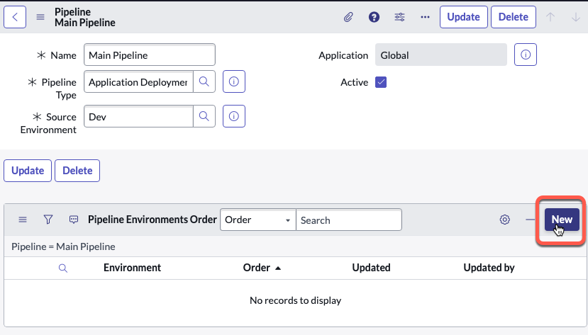
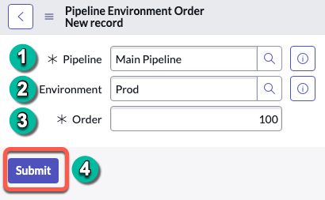
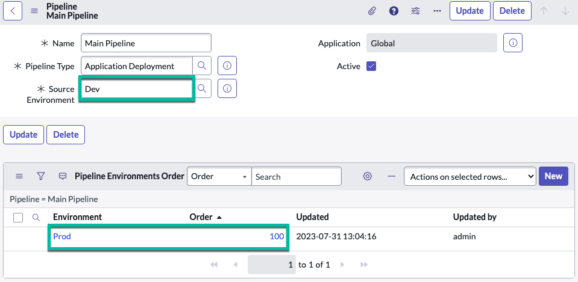

# Configure Pipeline in Prod

import TimeEstimate from '@site/src/components/TimeEstimate';

<TimeEstimate>Estimated Time to Complete: 15 minutes</TimeEstimate>

## Overview

**<a href="https://docs.servicenow.com/csh?topicname=config-pipeline.html&version=latest" target="_blank">Pipelines ↗</a>** establish the path an application takes from Development to Production.

This facilitates administrators' ability to efficiently transfer applications across different instances in the App Engine Management Center.

The process involves setting up and configuring your pipeline, specifying the **<a href="https://docs.servicenow.com/csh?topicname=config-pipeline-environments.html&version=latest" target="_blank">Environments ↗</a>** to include, and determining their position in the pipeline. 

The Pipeline is exclusive to the Controller Environment, which in this case is the Production instance. 

### Before

### After

### **EXAMPLE ONLY** 
*If you had a Test or other Subprod environments, the Pipeline would get defined like this:*

:::danger
In this Lab, you will only configure Dev and Prod in the Pipeline.
:::

## Instructions

:::caution
For this exercise, the specific Application Scope is not critical - Global is acceptable. Always check with your Platform Administrator for any company policies around **<a href="https://docs.servicenow.com/csh?topicname=connection-alias.html&version=latest" target="_blank">Connection and Credential Aliases ↗</a>**.
:::

:::warning
**Complete this section in PROD.**
 
There's **NO** necessity to create a Pipeline in any other environment. 
:::

1. Click **All** >> type **pipelines** >> click **Pipelines**.

2. Initiate a new pipeline: Click **New** in the top-right corner.

3. Fill out the form as follows:

|#|Field | Value                     
|--|--|--
|1|**Name** | Main Pipeline
|2|**Pipeline Type** | Application Deployment
|3|**Source Environment** | Dev                     
|4|**Active** | **Checked**

4. Submit the form.

5. Open the newly created **Main Pipeline** record.

6. Click **New** in the **Pipeline Environments Order** related list.

7. Complete the new form as shown below and click **Submit** when done.

|#| Field       | Value           
|-|-|-
|1| **Pipeline**    | Main Pipeline
|2| **Environment** | Prod
|3| **Order**       | 100

Your completed Pipeline record will look like this:

 

:::warning
Make sure your Pipeline configuration matches the screenshot above.
 
DO NOT add Dev to the **Pipeline Environments Order** related list. 
 
It is the **Source Environment** and does not get added to the additional environments list. 
:::

## Lessons Learned

Through this exercise, we grasped the importance of correctly configuring the Pipeline in the Production instance.