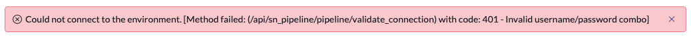

# Before you begin

import TimeEstimate from '@site/src/components/TimeEstimate';

<TimeEstimate>Estimated Time to Complete: 5 minutes</TimeEstimate>

Below are some tips and tricks that you may find useful in the lab today.

## Copy Paste

There are several times in the exercises where you will need to copy and paste values. 

To make this easier, we have added a clipboard icon to the end of the fields to automatically copy to your clipboard for you. 


Here is an example to play with:

```markdown
Copy me!
```

<input type="text" name="paste" placeholder="Paste here!"/>

---

## Triple Click

Did you know you can triple click to select an entire row on a webpage? Try it using the text below.

| Select this entire sentence by triple clicking then press CTRL+C to copy. |
|----------|

<input type="text" name="paste" placeholder="Paste here!"/>

---

## Username and Passwords

In some of the sections, you will be copying and pasting user credentials. 

You MUST use the values provided as that is the password that is already set for that account. 

If you do not use the provided username and password, you will get the following error:




Here is the text from the screenshot above:

:::warning
Could not connect to the environment. [Method failed: (/api/sn_pipeline/pipeline/validate_connection) with code: 401 - **Invalid username/password combo**]
:::
