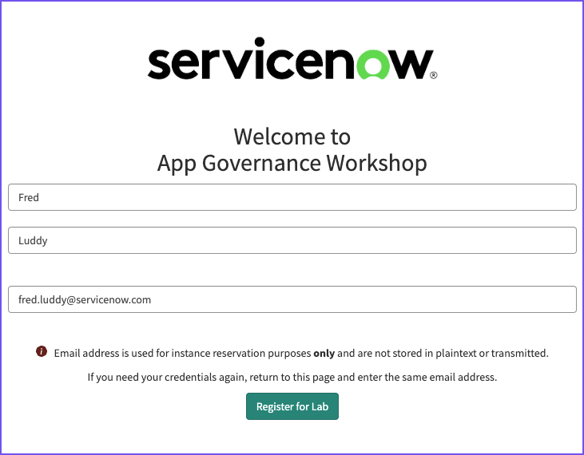
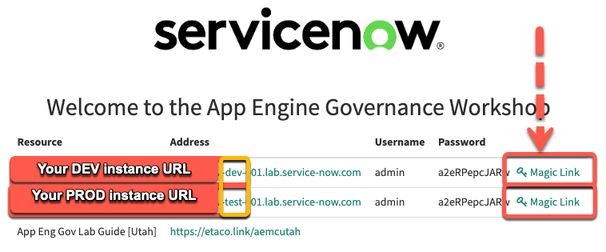

# Get a Lab instance

import TimeEstimate from '@site/src/components/TimeEstimate';

<TimeEstimate>Estimated Time to Complete: 10 minutes</TimeEstimate>

## Overview 

In this exercise, you will register for and access two distinct ServiceNow Lab instances. These instances will be utilized throughout the lab to familiarize yourself with different aspects of ServiceNow. 

## Instructions 

:::info
Your instructor will provide you with a URL that will load a form similar to below. 
:::

1. Enter your name and email address, then click the button **Register for Lab**. 

:::info
Remember, if you lose your credentials, you can return to this page and re-enter the same information to retrieve them.
:::

2. Enter the unique registration code provided by your instructor and click **Complete Registration**.

3. A final screen will be displayed with the URL for your **Dev** and **Prod** instances. 

*Click the **Magic Link** to automatically log in to an instance.*

:::info
ServiceNow provisions Labs with two instances labeled "dev" and "test" in the URL. Despite the naming, refer to and utilize the "test" instance as your "Prod" instance for the entirety of this Lab.
:::

## Lessons Learned

Upon completing this section, you've achieved the following:
- Successfully registered for two ServiceNow Lab instances.
- Understand the distinction between the instances, one is dev and we will treat the other as prod. 
- Know how to retrieve lost lab credentials.
- Can access and log in to each instance through the provided Magic Links.

