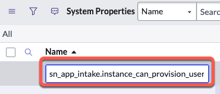
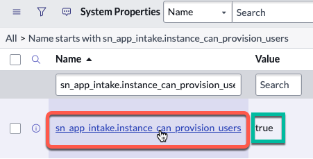
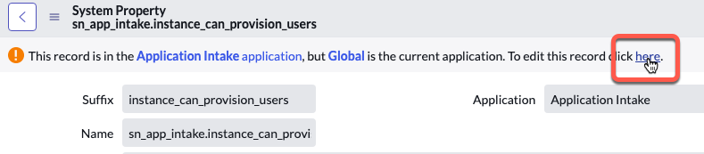
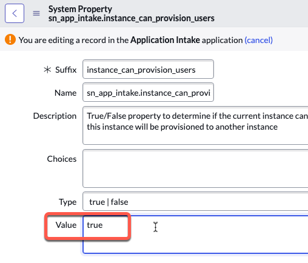

# User Provisioning

import TimeEstimate from '@site/src/components/TimeEstimate';

<TimeEstimate>Estimated Time to Complete: 5 minutes</TimeEstimate>

:::info
This section has already been configured as part of the automated setup for this lab. 

**THIS SECTION IS OPTIONAL AND CAN SAFELY BE SKIPPED IF YOU ARE BEHIND.**
:::

## Overview

The system property **sn_app_intake.instance_can_provision_user** determines if the current instance can support the automated provisioning of users in the Development environment.

If you prefer to manually add users to groups in Dev, then you would set this property to **false**.

## Instructions

1. Click **All** >> type ```sys_properties.list``` >> press ENTER. 


2. Click the mangnifying glass to the left of the **Name** column.


3. Type the name of the system property into the field under the **Name** column and press ENTER.

    ```sn_app_intake.instance_can_provision_users```



4. Click the name of the system property to open it. It should already be set to **true** for you.



5. Click the word **here** to switch from Global to the application scope **Application Intake**.



:::caution
**REMEMBER:** This value was already set to 'true' for you as part of the automated lab setup. 
:::

6. Change the **Value** field from 'false' to 'true'.



7. Click the **Update** button to save your changes. 


## Lessons Learned

This exercise highlighted the importance of understanding and manipulating system properties within ServiceNow.

1. **System Properties:** The task illustrated the role of the system property **sn_app_intake.instance_can_provision_user** in managing automated user provisioning. Such system properties form the backbone of how instances behave in ServiceNow, affecting a wide array of operations and features.

2. **User Provisioning:** We understood how enabling or disabling automated user provisioning could impact the process of adding users to groups in the Development environment. Depending on the unique needs and preferences of an organization, the option to manually add users might be chosen over automation.

Moving forward, these lessons will facilitate more efficient and effective system configurations and foster a deeper understanding of the underlying principles of ServiceNow's operation.

