# App Intake - Catalog Item

import TimeEstimate from '@site/src/components/TimeEstimate';

<TimeEstimate>Estimated Time to Complete: 10 minutes</TimeEstimate>

:::info
This section has already been configured as part of the automated setup for this lab. 

**THIS SECTION IS OPTIONAL AND CAN SAFELY BE SKIPPED IF YOU ARE BEHIND.**
:::

## Overview

Create a custom app intake experience for your organization by editing the fields and questions on the App Engine Studio (AES) App Intake form in Catalog Builder.

## Instructions

1. Click the Globe in the top right of the page, type "**application intake**", and click **Application Intake**.

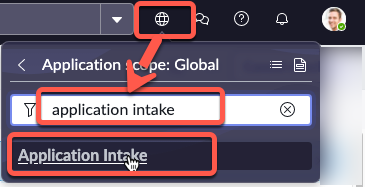

2. Click **All**, type **maintain items**, and then click **Maintain Items**.

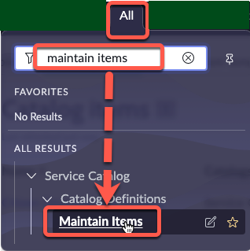

3. In the **Name** column, type "**apply for**" and click **Apply for Citizen Development - V2**.

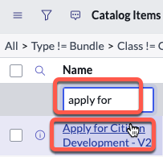

4. Check the **Active** box, click the hamburger button, then click **Save**.

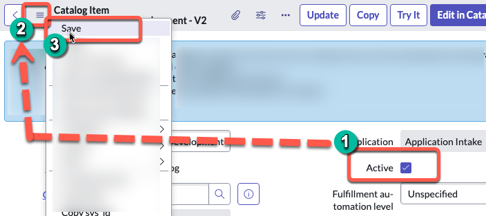

5. Remove "**- V2**" from the **Item name** field, click the hamburger button, then click **Save**.

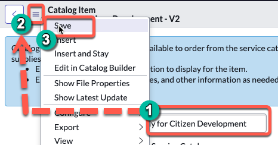

6. Scroll to the bottom of the page, click the **Variables** tab, and click **New**.

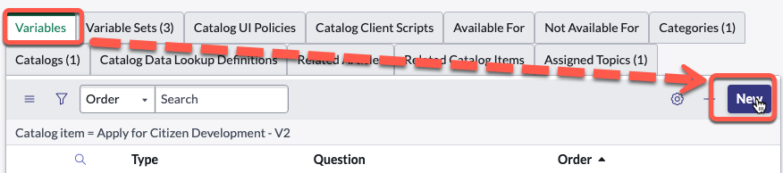

7. Set the **Order** field to '150'.

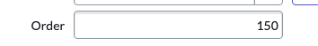

8. Type any question and press TAB.  (Example: "Is this part of the lab?)

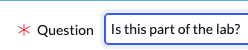

9. After you press TAB, the system should automatically populate the **Name** field. 

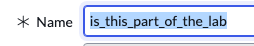

10. Click **Submit**.

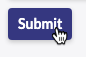

11. Click **Try it** to preview the Item.

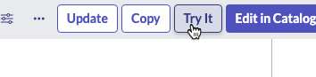

You should see your new question on the catalog item form.

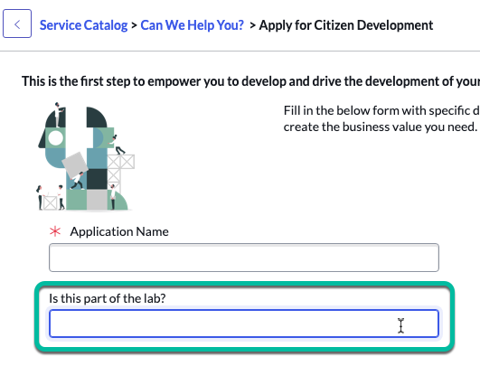

## Lessons Learned

In this process, we've learned how to customize the App Engine Studio (AES) App Intake form for a tailored experience. By creating and adding our variables, we can modify the form to ask pertinent questions specific to our organizational requirements. Additionally, we've learned the importance of properly ordering these variables to ensure a smooth intake process.

:::info
For more information see **<a href="https://docs.servicenow.com/csh?topicname=customize-app-intake-form-catalog-builder.html&version=latest" target="_blank">Product Docs: Customize the App Intake form in Catalog Builder ↗</a>**
:::

