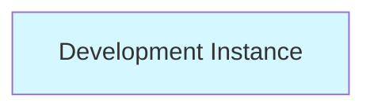
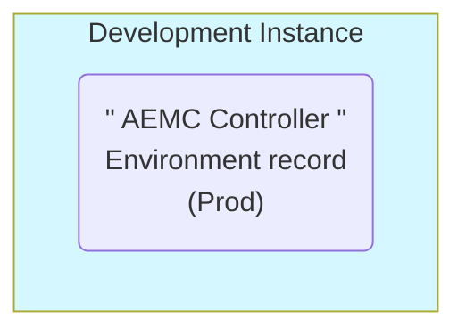
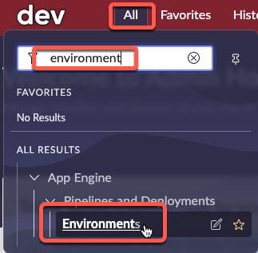
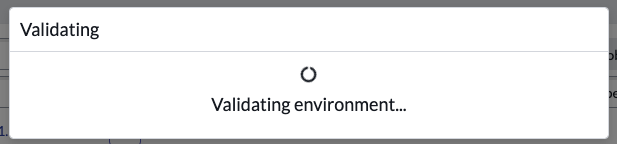

# Create Controller Environment

import TimeEstimate from '@site/src/components/TimeEstimate';

<TimeEstimate>Estimated Time to Complete: 10 minutes</TimeEstimate>

## Overview

Production is considered the "Controller" Environment as that is where App Engine Management Center is installed and orchestrates activities from. 

Next up, you add an Environment record to your Dev instance containing the details for your Prod instance. 

### Before

### After

## Instructions

:::caution
For this exercise, the specific Application Scope is not critical - Global is acceptable. Always check with your Platform Administrator for any company policies around **<a href="https://docs.servicenow.com/csh?topicname=connection-alias.html&version=latest" target="_blank">Connection and Credential Aliases ↗</a>**.
:::

:::warning
Complete this section in **DEV**.
:::

1. Log in **DEV**.

2. Click **All** >> type **environment** >> click **Environments** 

3. Click **New** in the top-right.

4. Complete the form using the information below. 

:::caution
**FOR THE INSTANCE URL YOU MUST PUT THE PROD INSTANCE URL!!!**
:::

|Field | Value 
|:---|:---
|**Name** | AEMC Controller 
|**Instance Type**| Production 
|**Instance URL** | 
|**Instance credential** | Pipeline_Credentials 
|**Is Controller?** | **CHECK THE BOX**
|**Instance Id** | This will auto populate after clicking Validate.

5. Click **Validate**.

You should see a blue message that says "The controller environment was validated successfully". 

6. Click **Submit** to finish creating the **Prod** environment record.

## Lessons Learned

Throughout this exercise, we have gleaned important insights that can guide future procedures:

1. **Importance of the Controller Environment**: Setting up the Controller Environment is crucial for the operation of the App Engine Management Center. This exercise emphasizes the vital role of the Production instance, as it's where AEMC is installed and from where it orchestrates activities.

2. **Need for Accuracy**: The necessity of accurate input, especially when entering the Instance URL and designating the Controller, underlines the importance of attention to detail when setting up environments. One incorrect entry can hinder the functionality of the entire system.

3. **Validation Process**: The validation process ensures that the environment setup is correct and functional. The success message serves as confirmation that the system is correctly configured, reducing the potential for future issues.