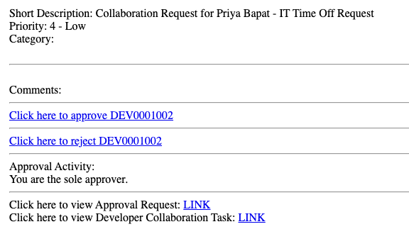
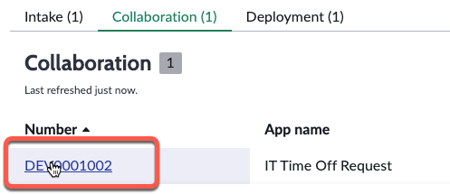
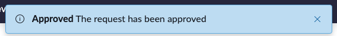

# Collaboration Approval

import TimeEstimate from '@site/src/components/TimeEstimate';

<TimeEstimate>Estimated Time to Complete: 5 minutes</TimeEstimate>

## Overview

When Sydney submitted the Collaboration Request in App Engine Studio, it triggered an email to Jayne prompting her to take action. 

:::info
**SUBJECT:** Developer Collaboration Task DEV0001002 Approval Request

:::

Jayne decides to log in to take a closer look before approving. 

## Instructions 

:::warning
Complete this section in **PROD**.
:::

:::caution
You should still have a browser tab for **Prod** opened to App Engine Management Center in which you are impersonating Jayne. 
 
If not, follow these quick instructions to be sure:
 
1. Click the avatar in the top-right, then click **Impersonate another user**.
 
2. Type **Jayne Nigel** and click **Jayne Nigel**.
 
3. Click **Impersonate user**.
 
4. Click **All** >> type **app engine management** >> click **App Engine Management Center**.
 
This will open AEMC in a new browser tab.
:::

1. Click **Overview** in App Engine Management Center

 

2. Click the **1** above **Collaboration**

3. Click the **DEV** ticket to open Sydney's Collaboration request.

4. Click **Approve** in the top-right of the page. 

5. Click **Overview** to return to the main AEMC page.

After Jayne approved the Collaboration Request, Sydney received an email to inform her that the request was approved. 

:::info
**SUBJECT:** Your collaborator request was approved

:::

## Lessons Learned

**Great!!** Approving the request triggered AEMC to automatically provision Priya's access to work on the app with Sydney as an Integration Specialist.