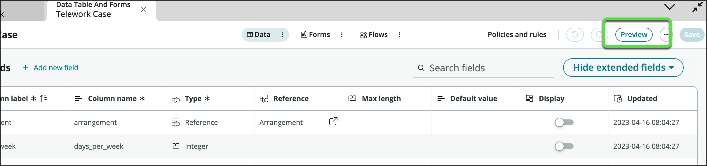
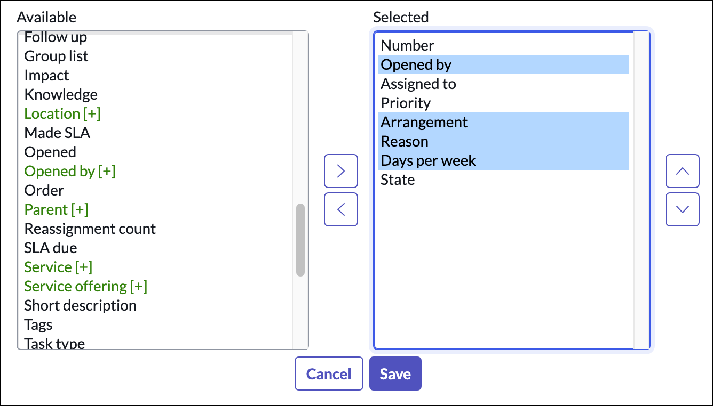
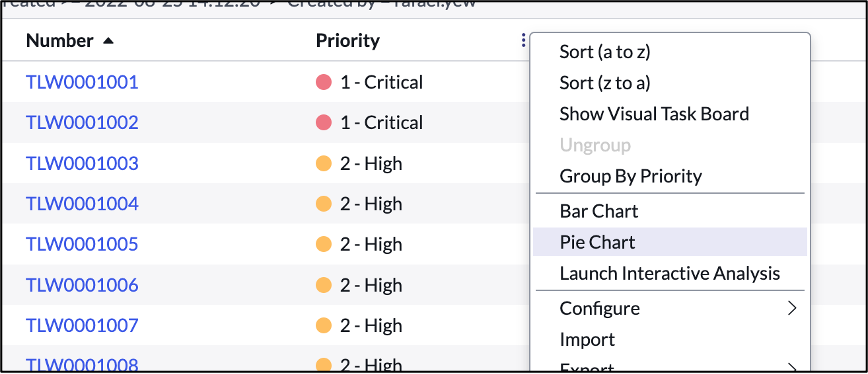
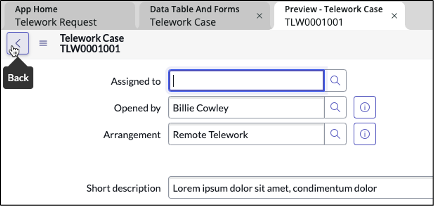
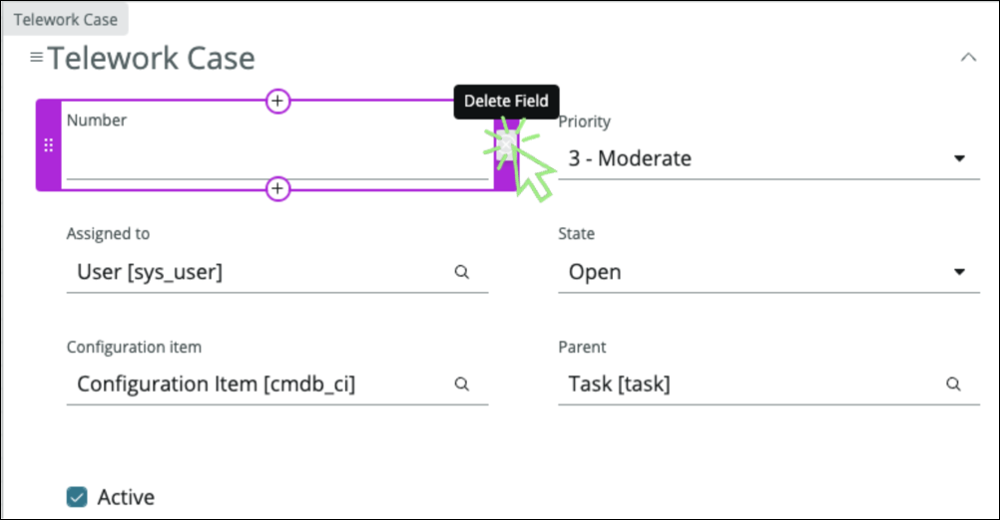
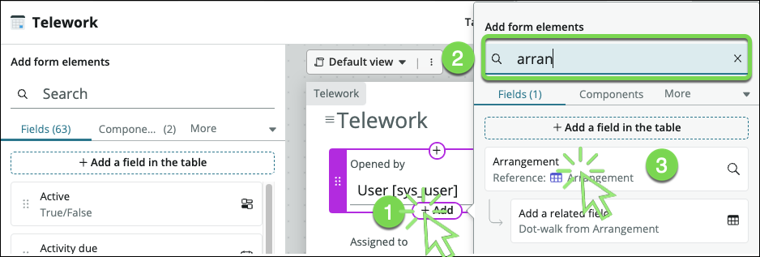
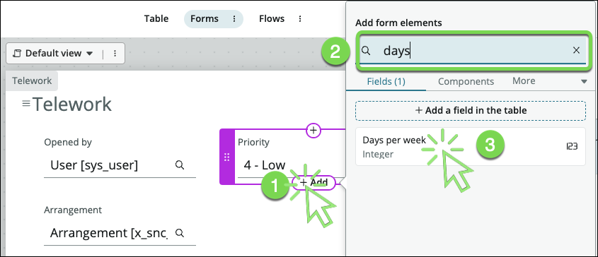
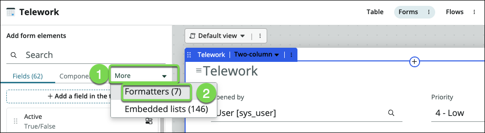
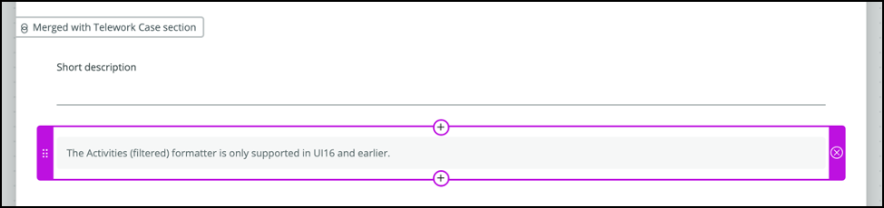
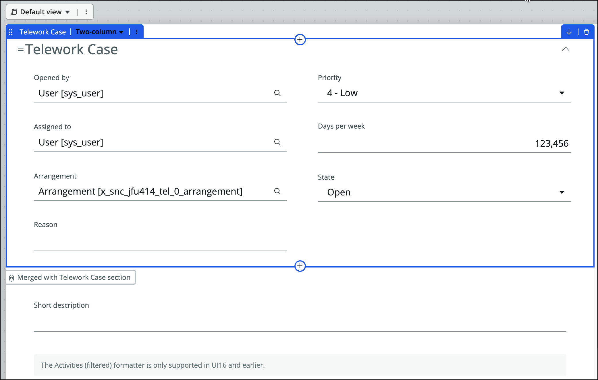

## Part 1 - Configure Telework Case List 

1. From the **Data Table And Forms** tab, **preview** the Telework table.

 

2. Let's update the columns in this list layout.

3. Right click at the top of the Number column and click on **Configure** -\> **List Layout**.

 

4.  Move "Task type" to the left hand window and click Save.

 

5. Add **Opened By, Arrangement, Reason, and Days per week**, and Click **Save**.

Next, let's start working and managing our records.

6.  Hover the column header **Priority** , **right-click** to display the menu and then select **Pie Chart**.

 

7.  And voila, we get a Pie chart that shows us the distribution of cases by Priority.

 

8.  Explore the other tools in the Context Menu such as Visual Task Board.

9.  The team struggles managing and understand the status of related tasks. Let's fix that.

10.  Click the back button on the Pie Chart report to get back to the list.
    
  

11.  Open a record by clicking the number field.

  

12.  Configure the related list by doing:

     1. Right-click on header.
     2. Select **Configure**.
     3. Then select **Related Lists**.

  

13.  In the new form:

     1. Select the item **Task → Parent**.
     2. Click on the button to move the item to the selected list.
     3. Click on the Save button.

  

Now a new tab at the bottom of the form will show records that have relationships to the current record.

14. Go back to the list view by clicking on the back button at the top.

 

15. We can even start creating new records/cases. Click **New** in the top right.

 

16. But wait, the form doesn't have the fields we want. Let's fix that.

17. Close the Preview tab by **clicking** the **X**.

 

## Part 2 - Configure Telework Case Form

1. At the top-center of the table, click **Forms**.

 

    As we created our table by extending the Task table, we inherited some fields we don't need for our use case.

2. Remove the following fields (by clicking the X)

    1. Number
    2. Configuration Item
    3. Active
    4. Parent

 

3. Users want to see who opened the case. We can easily fulfill the requirement by reusing the **Opened by** field from the Task table. In the Fields tab to the left is where existing fields can be added. 

:::info

Note that there are more than 60 fields available to use. The number of fields may be different as other ServiceNow application may add fields onto the Task table.

:::

4. Click the circled plus icon ⊕ to add a field above

 

5. (1) Type **Opened by** in the Search box and then (2) click on the **Opened by** field

 

6. Repeat the operation to add the field **Arrangement**

 

7. Add the field **Days per week**

 

8. Add the field **Reason**

 

9. Now we'll add the Activity formatter that provides a way to present the audit history of a particular record

10. (1) Click **More**  and then (2) click **Formatters**

 

11. Drag the "**Activities (filtered)**" field onto the form below the Short description field.

 

12. Your form should look like something this (doesn't have to have exact same layout):

 

13. On the top right, Click on the Save button

 

**Exercise Recap**

In this exercise, we learned how to modify the list and form views for our Telework Case table.

We also saw some useful things you can do from the list view to generate quick reports.

We were able to complete all these tasks using simple point-and-click administration and without requiring specialized application or database knowledge.